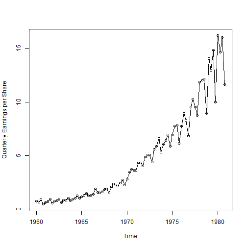
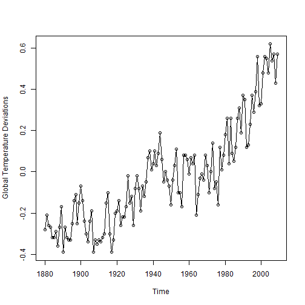
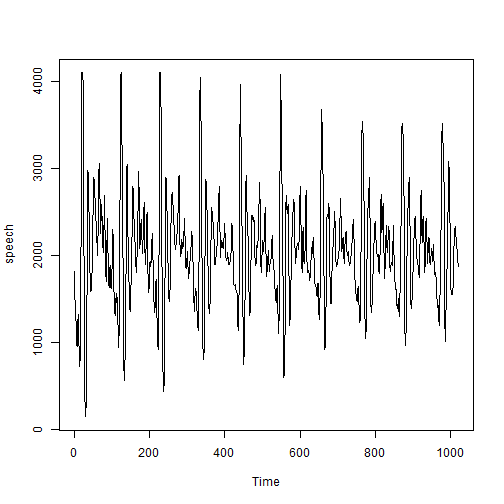
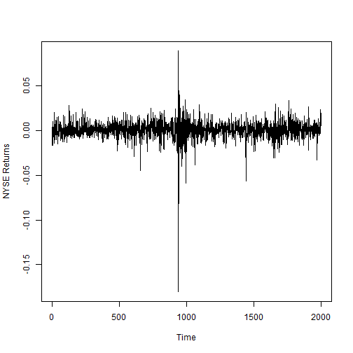
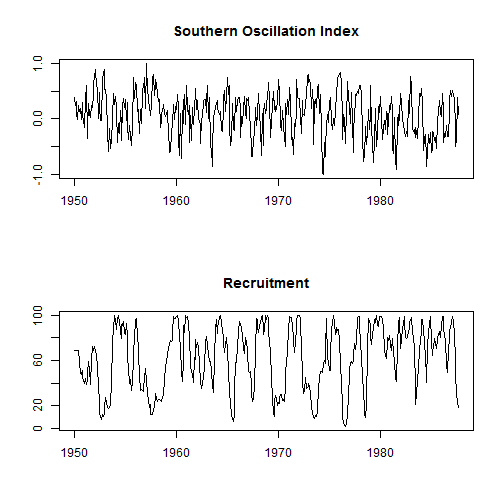

## Chapter

### Section 1.2
Examples of time series data


```r
library(astsa)
plot(jj, type = "o", ylab = "Quarterly Earnings per Share")
```

 
Time series data is its own data type in R with a default print function


```r
head(gtemp)
```

```
## [1] -0.28 -0.21 -0.26 -0.27 -0.32 -0.32
```

```r
class(gtemp)
```

```
## [1] "ts"
```

```r
summary(gtemp)
```

```
##     Min.  1st Qu.   Median     Mean  3rd Qu.     Max. 
## -0.39000 -0.21750 -0.05000 -0.02162  0.09750  0.62000
```

```r
str(gtemp)
```

```
##  Time-Series [1:130] from 1880 to 2009: -0.28 -0.21 -0.26 -0.27 -0.32 -0.32 -0.29 -0.36 -0.27 -0.17 ...
```

```r
plot(gtemp, type = "o", ylab = "Global Temperature Deviations")
```

 
More examples from the book


```r
plot(speech)
```

 

```r
plot(nyse, ylab = "NYSE Returns")
```

 

```r
par(mfrow = c(2, 1))
plot(soi, ylab = "", xlab = "", main = "Southern Oscillation Index")
plot(rec, ylab = "", xlab = "", main = "Recruitment")
```

 


